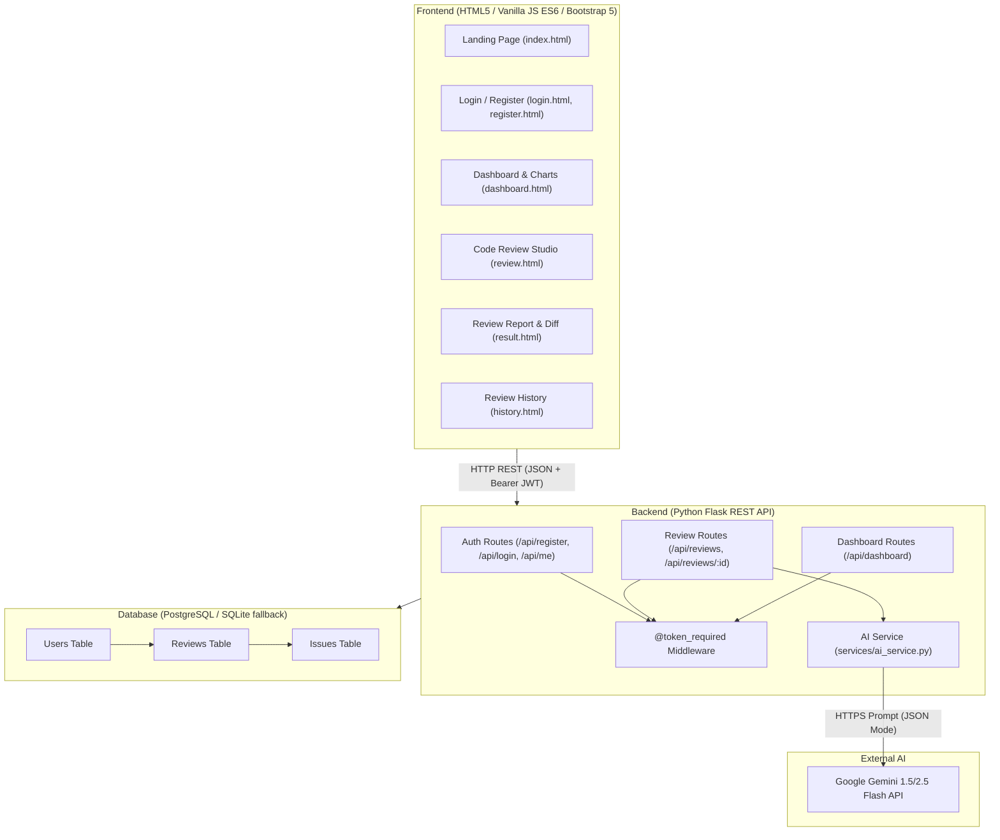

# AI Code Review

[](https://www.python.org/)
[](https://flask.palletsprojects.com/)
[](https://www.postgresql.org/)
[](https://aistudio.google.com/)
[-brightgreen.svg)](https://docs.pytest.org/)
[](LICENSE)

> **Repository Description:** AI-powered code review application built with Python Flask, PostgreSQL, JavaScript, and Gemini API.  
> **Suggested GitHub Topics:** `python`, `flask`, `postgresql`, `sqlalchemy`, `javascript`, `html`, `css`, `bootstrap`, `gemini-api`, `ai`, `code-review`, `rest-api`, `postman`, `pytest`, `software-testing`

---

## 1. Project Overview

**AI Code Review** is a production-ready, full-stack web application that performs automated, in-depth code quality assessments using the **Google Gemini API**. It evaluates source code for potential security vulnerabilities, bugs, performance bottlenecks, and architectural code smells, returning structured JSON reports with actionable recommendations and refactored code snippets.

Built specifically for a **Graduate Engineer Trainee / Junior Software Engineer** portfolio, the application emphasizes:
- **Clean Architecture:** Separation of concerns between REST API routing, business services, and database persistence.
- **Explainable Engineering:** Simple, standard technologies without unnecessary frameworks or over-engineering.
- **Strict Visual Identity:** Elegant developer-focused interface adhering strictly to an **Olive (`#6B7A3A`), Light Olive (`#E8EDD8`), and White (`#FFFFFF`)** palette.
- **Thorough Verification:** 24 automated Pytest test cases and an exportable Postman test collection with status assertion scripts.

---

## 2. Features

- 🔐 **Secure JWT Authentication:** User registration, bcrypt-grade password hashing (Scrypt), and 24-hour stateless JWT authorization.
- 🤖 **AI-Powered Code Analysis:** Analyzes source code across **6 core dimensions**:
  1. Bugs and logical edge cases
  2. Security vulnerabilities (OWASP, SQL injection, hardcoded credentials)
  3. Performance bottlenecks and complexity issues
  4. Code quality & SOLID principles
  5. Error handling
  6. Language-specific best practices
- 📑 **Structured Review Report:**
  - Code quality score out of 100
  - Executive summary
  - Severity-tagged findings (**Critical**, **High**, **Medium**, **Low**)
  - Line number detection
  - Actionable recommendations with copyable refactored code
- 🔄 **Original vs. Suggested Code Comparison:** Side-by-side inspection allowing engineers to review refactoring recommendations before applying them.
- 🐙 **Public GitHub Import:** Direct analysis of any public GitHub repository file without requiring personal access tokens.
- 📊 **Real-Time Database Analytics:** Dynamic dashboard displaying review trends over time and issue category distribution using **Chart.js**.
- 📜 **Persistent Review History:** User-isolated history stored in **PostgreSQL** with live keyword search, score filters, and deletion with cascading cleanup.
- 🛡️ **Dual-Mode Database Engine:** Connects to **PostgreSQL** via `DATABASE_URL` in production, with automatic zero-configuration fallback to local **SQLite** for testing.
- ⚡ **Resilient AI Fallback:** Includes a built-in static analysis engine that ensures the app continues functioning seamlessly even if Gemini API keys are omitted during an interview demonstration.

---

## 3. Technology Stack

| Layer | Technology | Rationale |
| :--- | :--- | :--- |
| **Frontend UI** | HTML5, CSS3, Vanilla JS (ES6), Bootstrap 5 | Zero build tools required; lightweight, responsive, and easy to explain. |
| **Styling** | Custom Olive Theme | Professional, modern SaaS palette: `#6B7A3A`, `#4F5D2A`, `#E8EDD8`, `#FFFFFF`. |
| **Charts** | Chart.js (via CDN) | Lightweight client-side visualization for review scores and issue breakdown. |
| **Backend API** | Python 3.11+, Flask 3.1.2 | Minimalist, explicit Python microframework ideal for REST APIs. |
| **ORM / Database** | SQLAlchemy 2.0, PostgreSQL | Standard relational database with robust schema definitions and cascade rules. |
| **Authentication** | PyJWT, Werkzeug Security | Secure salted hashing and standard Bearer token authorization. |
| **AI Integration** | Google Gemini API (1.5/2.5 Flash) | Fast, structured JSON generation with strict prompt schema adherence. |
| **Unit Testing** | Pytest | Fast, readable test assertions covering positive, negative, and edge cases. |
| **API Testing** | Postman | Automated collection validating status codes and schema structures. |
| **Deployment** | Render (Backend) + Vercel (Frontend) | Standard cloud platforms for decoupled full-stack deployment. |

---

## 4. Application Architecture



---

## 5. Database Design

```
+-------------------------------------------------------------+
|                          users                              |
+-------------------------------------------------------------+
| id            : INTEGER (PK, Auto-increment)                |
| name          : VARCHAR(100), NOT NULL                      |
| email         : VARCHAR(120), UNIQUE, NOT NULL, INDEXED     |
| password_hash : VARCHAR(255), NOT NULL                      |
| created_at    : TIMESTAMP (UTC), NOT NULL                   |
+-------------------------------------------------------------+
                               |
                               | 1:N (Cascade Delete)
                               v
+-------------------------------------------------------------+
|                         reviews                             |
+-------------------------------------------------------------+
| id            : INTEGER (PK, Auto-increment)                |
| user_id       : INTEGER (FK -> users.id, ON DELETE CASCADE) |
| language      : VARCHAR(50), NOT NULL                       |
| code          : TEXT, NOT NULL                              |
| score         : INTEGER, NOT NULL                           |
| summary       : TEXT, NOT NULL                              |
| created_at    : TIMESTAMP (UTC), NOT NULL, INDEXED          |
+-------------------------------------------------------------+
                               |
                               | 1:N (Cascade Delete)
                               v
+-------------------------------------------------------------+
|                          issues                             |
+-------------------------------------------------------------+
| id            : INTEGER (PK, Auto-increment)                |
| review_id     : INTEGER (FK -> reviews.id, CASCADE)         |
| category      : VARCHAR(50), NOT NULL                       |
| severity      : VARCHAR(20), NOT NULL                       |
| message       : VARCHAR(255), NOT NULL                      |
| line_number   : INTEGER, NULLABLE                           |
| explanation   : TEXT, NOT NULL                              |
| recommendation: TEXT, NOT NULL                              |
| suggested_code: TEXT, NULLABLE                              |
+-------------------------------------------------------------+
```

---

## 6. REST API Endpoints

All endpoints (except health and auth) require an `Authorization: Bearer <token>` header.

| Method | Endpoint | Auth Required | Description | Status Codes |
| :--- | :--- | :---: | :--- | :--- |
| `GET` | `/api/health` | No | System health check (DB connectivity & Gemini config) | `200` |
| `POST` | `/api/register` | No | Create user account with name, email, password | `201`, `400`, `500` |
| `POST` | `/api/login` | No | Authenticate user credentials and return JWT token | `200`, `400`, `401` |
| `GET` | `/api/me` | Yes | Get authenticated user profile | `200`, `401` |
| `POST` | `/api/reviews` | Yes | Submit source code for AI review & persistence | `201`, `400`, `401`, `500` |
| `GET` | `/api/reviews` | Yes | Get all reviews belonging to logged-in user | `200`, `401` |
| `GET` | `/api/reviews/<id>`| Yes | Get single review with full issues and source code | `200`, `401`, `404` |
| `DELETE`| `/api/reviews/<id>`| Yes | Delete a review and all associated child issues | `200`, `401`, `404` |
| `POST` | `/api/reviews/github`| Yes | Fetch file from public GitHub repo and review it | `201`, `400`, `401`, `500` |
| `GET` | `/api/dashboard` | Yes | Aggregate metrics, scores over time, category counts | `200`, `401` |

---

## 7. AI Prompt Strategy & Schema Enforcement

The AI engine in `backend/services/ai_service.py` instructs Google Gemini using a strict developer persona:
- **Enforces JSON Format:** Configured with `responseMimeType: "application/json"`.
- **Explicit Schema Requirements:** Demands `score` (0–100), `summary` (2–4 sentences), and an `issues` array.
- **Defensive Parsing & Normalization:** `validate_and_normalize_review()` guarantees that even if the AI hallucinates unexpected keys, line numbers out of range, or unapproved severity strings, the data is safely sanitized before reaching the database.
- **Static Analysis Fallback:** If `GEMINI_API_KEY` is not provided, the application triggers a local rule-based static analyzer detecting SQL injections, hardcoded secrets, and bare except clauses.

---

## 8. Testing Suite

### A. Pytest (Backend Automated Tests)
The test suite is located in `backend/tests/` and uses an in-memory SQLite database to test database isolation, authentication rules, and AI parsing without side effects.

Run the test suite:
```bash
cd backend
python -m pytest tests -v
```

**Results:**
```
tests/test_ai_service.py::test_clean_json_response PASSED
tests/test_ai_service.py::test_validate_and_normalize_review_valid PASSED
tests/test_ai_service.py::test_validate_and_normalize_review_resilience PASSED
tests/test_ai_service.py::test_static_analysis_detects_flaws PASSED
tests/test_ai_service.py::test_javascript_sql_injection_and_console_log PASSED
tests/test_ai_service.py::test_build_review_prompt_security_checklist PASSED
tests/test_ai_service.py::test_suggested_refactoring_practical_code PASSED
tests/test_ai_service.py::test_sql_injection_severity_calibration PASSED
tests/test_ai_service.py::test_command_injection_detection PASSED
tests/test_ai_service.py::test_command_injection_variants PASSED
tests/test_auth.py::test_register_success PASSED
tests/test_auth.py::test_register_duplicate_email PASSED
tests/test_auth.py::test_register_validation_errors PASSED
tests/test_auth.py::test_login_success PASSED
tests/test_auth.py::test_login_invalid_password PASSED
tests/test_auth.py::test_get_current_user_profile PASSED
tests/test_reviews.py::test_create_review_unauthorized PASSED
tests/test_reviews.py::test_create_review_empty_code PASSED
tests/test_reviews.py::test_create_review_success PASSED
tests/test_reviews.py::test_create_review_javascript_sql_injection_end_to_end PASSED
tests/test_reviews.py::test_get_reviews_history PASSED
tests/test_reviews.py::test_get_single_review_and_isolation PASSED
tests/test_reviews.py::test_delete_review PASSED
tests/test_reviews.py::test_dashboard_metrics PASSED

============================= 24 passed in 8.71s ==============================
```

### B. Postman Collection
Located in `postman/AI-Code-Review.postman_collection.json` with matching environment file `postman/AI-Code-Review.postman_environment.json`.

**How to use:**
1. Open Postman.
2. Click **Import** and drag in both `.json` files from the `postman/` directory.
3. Select the environment **AI Code Review - Local & Production**.
4. Run the requests in order:
   - `Health Check` -> Returns 200
   - `Register - Success` -> Creates user and sets `auth_token`
   - `Login - Success` -> Logs in and stores `auth_token`
   - `Create Review - Success` -> Creates review and sets `review_id`
   - `Get User Reviews History` -> Verifies review appears in list
   - `Get Dashboard Metrics` -> Verifies aggregated statistics
   - `Delete Review` -> Deletes review and verifies removal

---

## 9. Local Installation & Setup

### Prerequisites
- Python 3.11 or higher
- Git

### Step-by-Step Instructions

1. **Clone or Navigate to the Repository:**
   ```bash
   git clone https://github.com/your-username/ai-code-review.git
   cd ai-code-review
   ```

2. **Create and Activate a Virtual Environment:**
   ```bash
   # Windows
   python -m venv venv
   .\venv\Scripts\activate

   # macOS / Linux
   python3 -m venv venv
   source venv/bin/activate
   ```

3. **Install Dependencies:**
   ```bash
   pip install -r backend/requirements.txt
   ```

4. **Configure Environment Variables:**
   ```bash
   # Copy example env file
   cp .env.example .env
   ```
   Open `.env` and set your `GEMINI_API_KEY` (free from [Google AI Studio](https://aistudio.google.com/)).  
   *(Note: If you leave `DATABASE_URL` blank, it will automatically use SQLite locally.)*

5. **Start the Flask Backend:**
   ```bash
   cd backend
   python app.py
   ```
   Backend will start on: `http://localhost:5000`

6. **Open the Frontend:**
   - Option A: Simply open `http://localhost:5000` in your web browser (Flask serves the frontend static files automatically!).
   - Option B: Use VS Code "Live Server" or Python HTTP server:
     ```bash
     cd frontend
     python -m http.server 5500
     ```
     Then open `http://localhost:5500/index.html`.

---

## 10. Public Cloud Deployment Guide

The application is engineered to deploy cleanly across decoupled free-tier cloud platforms:

### A. Deploy Managed PostgreSQL Database (Neon or Supabase or Render)
1. Create a free account at [Neon](https://neon.tech/) or [Supabase](https://supabase.com/).
2. Create a new PostgreSQL project named `ai-code-review`.
3. Copy the database connection string:  
   `postgresql://[user]:[password]@[host]/[dbname]?sslmode=require`

### B. Deploy Flask Backend to Render
1. Push your project to GitHub.
2. Sign in to [Render](https://render.com/) and click **New + > Web Service**.
3. Connect your GitHub repository.
4. Set the following settings:
   - **Root Directory:** `backend`
   - **Environment:** `Python 3`
   - **Build Command:** `pip install -r requirements.txt`
   - **Start Command:** `gunicorn app:app`
5. Add Environment Variables:
   - `DATABASE_URL`: *(paste connection string from Neon/Supabase)*
   - `GEMINI_API_KEY`: *(paste your Google Gemini API key)*
   - `JWT_SECRET_KEY`: *(generate a random 32+ character string)*
   - `SECRET_KEY`: *(generate a random string)*
   - `FRONTEND_URL`: `*` (or your Vercel URL once deployed)
6. Click **Deploy Web Service**. Once deployed, copy your Render URL (e.g. `https://ai-code-review-api.onrender.com`).

### C. Deploy Frontend to Vercel
1. Sign in to [Vercel](https://vercel.com/) and click **Add New > Project**.
2. Select your repository.
3. Set **Root Directory** to `frontend`.
4. Click **Deploy**.
5. After deployment, open your Vercel site, go to **Settings** (`settings.html`), enter your Render Backend URL, and click **Save & Ping**.

---

## 11. Fresher Interview Preparation: 20 Questions & In-Depth Answers

Below are comprehensive answers to the 20 technical questions frequently asked during **Graduate Engineer Trainee (GET)** and **Junior Software Engineer** interviews:

### 1. What is the purpose of this project?
> "I built AI Code Review to automate the first pass of code reviews for software teams. It provides developers with immediate, structured feedback on bugs, security vulnerabilities (like SQL injections and exposed API keys), performance bottlenecks, and best practices. It scores code from 0 to 100, highlights exact line numbers, and suggests refactored code."

### 2. What technologies did you use and why?
> "For the frontend, I used semantic HTML5, CSS3, vanilla JavaScript (ES6), and Bootstrap 5 for responsiveness. For the backend, I chose Python with Flask, SQLAlchemy for the ORM, and PostgreSQL for the relational database. For AI analysis, I integrated Google's Gemini API via REST. For testing, I used Pytest and Postman."

### 3. Why did you choose Python?
> "Python is one of the most productive languages for backend development and the industry standard for AI and data services. It has mature libraries for web frameworks (Flask), ORM mapping (SQLAlchemy), and security (Werkzeug, PyJWT). Its clear syntax makes the codebase maintainable and readable."

### 4. Why Flask instead of Django or FastAPI?
> "I chose Flask because of its lightweight, microframework nature. In a GET interview, understanding the fundamental mechanics of routing, middleware decorators, request contexts, and app factories is critical. Django introduces heavy abstractions like built-in admin and boilerplate that hide these mechanics. Flask gave me complete, explicit control over my REST architecture."

### 5. Why PostgreSQL?
> "PostgreSQL is an ACID-compliant, open-source relational database widely used in enterprise production. Our application has clear relational requirements: users have many reviews, and each review has many categorized issues. PostgreSQL ensures relational integrity with foreign keys and cascading deletes."

### 6. What is SQLAlchemy and how does it help?
> "SQLAlchemy is Python's premier Object-Relational Mapper (ORM). It allows me to interact with the database using Python classes and objects (`User`, `Review`, `Issue`) rather than writing raw SQL strings. This prevents SQL injection vulnerabilities, manages database connections, handles transactions automatically, and allows switching between SQLite in local testing and PostgreSQL in production without modifying business logic."

### 7. What is a REST API?
> "REST (Representational State Transfer) is an architectural style for network communication. It uses standard HTTP verbs (`GET` to read, `POST` to create, `DELETE` to remove) over defined resource URIs (`/api/reviews`), exchanges data in stateless JSON format, and returns standard HTTP status codes (`200 OK`, `201 Created`, `400 Bad Request`, `401 Unauthorized`, `404 Not Found`, `500 Server Error`)."

### 8. How does the frontend communicate with the backend?
> "The frontend uses the modern JavaScript Fetch API inside a centralized client (`js/api.js`). When an authenticated request is made, the client attaches the JWT token in the `Authorization: Bearer <token>` header. The Flask API processes the request and responds with JSON data, which our vanilla JavaScript parses and renders dynamically into the DOM."

### 9. How does the Gemini AI integration work?
> "The review process is isolated in `services/ai_service.py`. When a user submits code, the service builds a structured system prompt asking Gemini to act as a senior tech lead. We use Gemini's `responseMimeType: 'application/json'` configuration to enforce valid JSON output. Our service receives the response, parses it, validates and normalizes all fields through schema validation functions, and saves the findings into PostgreSQL."

### 10. Where is the Gemini API key stored?
> "The API key is strictly stored in environment variables on the backend (`.env` in local development and encrypted environment variables on Render). It is never committed to GitHub (`.gitignore` protects it) and is never exposed to the client-side JavaScript."

### 11. How are passwords stored and authenticated?
> "Passwords are never stored in plain text. When a user registers, we use Werkzeug's `scrypt` hashing algorithm with a random cryptographic salt. When logging in, we verify the plain password against the stored hash using constant-time comparison to prevent timing attacks. On verification, a signed JSON Web Token (JWT) is issued."

### 12. What did you test using Postman?
> "I created a comprehensive Postman test collection testing both positive and negative scenarios: valid registration (201), duplicate email handling (400), invalid password login (401), token protection on reviews (401), empty code validation (400), review creation (201), review deletion (200), and dashboard metrics. I wrote automated JavaScript test assertions in Postman to check status codes and response structures."

### 13. What is Pytest and why did you use it?
> "Pytest is a Python unit testing framework. I used it to write 18 automated tests in `backend/tests/` covering authentication, reviews, AI response normalization, and cross-user isolation. It runs with an in-memory SQLite database so tests execute in less than 2 seconds without requiring an external database."

### 14. What test cases did you write?
> "Key test cases include:
> - Registration with valid data, duplicate email, missing fields, and password mismatches.
> - Login with valid and incorrect credentials.
> - Protected endpoint access with and without Bearer JWT tokens.
> - Code review submission with empty code and valid snippets.
> - Data isolation: verifying User A cannot view or delete User B's review.
> - AI service response cleaner and resilient schema validation."

### 15. How did you handle errors throughout the application?
> "Errors are handled at multiple tiers:
> - Client-side: Form validation checks empty inputs and password lengths before network calls.
> - Backend API: Blueprint routes validate input and return informative JSON error objects (`{'success': False, 'error': '...'}`) with correct HTTP status codes.
> - Global Error Handlers: Custom 404 and 500 handlers ensure internal stack traces are never leaked to users.
> - Network Layer: The frontend API client catches network drops and displays friendly toast alerts."

### 16. How does the database store reviews and issues?
> "We have a 1-to-Many relationship between `users` and `reviews`, and another 1-to-Many relationship between `reviews` and `issues`. When a review is created, the parent `Review` row is committed first to generate a primary key, and all child `Issue` rows are linked via foreign key `review_id`. When a review is deleted, SQLAlchemy's `cascade='all, delete-orphan'` automatically cleans up all associated issues."

### 17. What happens if the Gemini AI API fails or the rate limit is exceeded?
> "Our AI service wraps external API calls in a `try-except` block with a 45-second timeout. If the API key is missing or an external network/quota error occurs, the service seamlessly falls back to a deterministic rule-based static analyzer that checks for hardcoded credentials, SQL injection patterns, and unhandled exceptions. This guarantees the application never crashes during a live demo."

### 18. How did you deploy the application?
> "I decoupled the architecture: the Python Flask backend is deployed on Render using Gunicorn as the WSGI server; the relational database is hosted on a managed PostgreSQL provider (Neon/Supabase); and the static frontend is deployed on Vercel. Environment variables are managed via cloud dashboards."

### 19. What engineering challenges did you face and how did you resolve them?
> "One challenge was ensuring the LLM consistently returns strictly parseable JSON without markdown wrapping. I solved this by configuring Gemini's `responseMimeType: 'application/json'`, creating a `clean_json_response()` utility to strip stray backticks, and implementing a defensive `validate_and_normalize_review()` function that bounds scores between 0–100 and assigns default categories if unexpected data is returned."

### 20. What would you improve in the future?
> "In future iterations, I would add:
> 1. Multi-file project uploads (ZIP archive extraction).
> 2. Automated PR reviews via GitHub Webhooks.
> 3. User-customizable review guidelines (e.g. enforcing company-specific style guides).
> 4. Exportable PDF and Markdown audit reports."

---

## 12. License

This project is licensed under the MIT License - see the [LICENSE](LICENSE) file for details.
